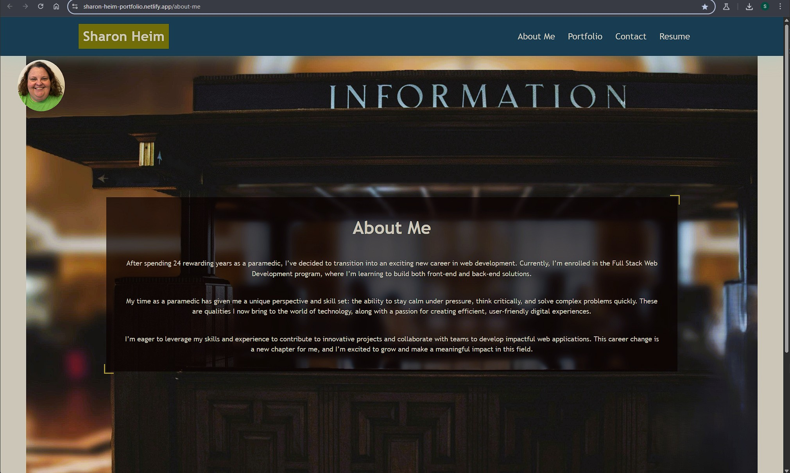

# Portfolio with React

_A single-page portfolio app built with React, Vite, and TypeScript, featuring project showcases, a contact form, and a downloadable resume._


**Live Demo:** [Portfolio on Netlify](https://sharon-heim-portfolio.netlify.app/)

---

## Table of Contents

- [Portfolio with React](#portfolio-with-react)
  - [Table of Contents](#table-of-contents)
  - [Description](#description)
  - [Features](#features)
  - [Prerequisites](#prerequisites)
  - [Technologies Used](#technologies-used)
  - [Quick Start](#quick-start)
  - [Installation](#installation)
  - [Usage](#usage)
  - [Screenshots](#screenshots)
    - [About Me](#about-me)
  - [Media](#media)
    - [Video Link](#video-link)
  - [License](#license)
  - [Notes](#notes)
  - [Contributions](#contributions)
  - [Support](#support)
    - [FAQ](#faq)
  - [Acknowledgments](#acknowledgments)
  - [Author](#author)

---

## Description

This portfolio is a single-page application (SPA) built using React and Vite. It showcases my web development projects, skills, and resume, and provides an easy way for potential employers or collaborators to get in touch. The site is fully responsive and optimized for both desktop and mobile devices.

---

## Features

- **About Me:** Short bio and profile photo.
- **Portfolio:** Six featured projects with titles, GitHub links, and deployed app links.
- **Contact Form:** Name, email, and message fields with validation.
- **Resume:** Downloadable resume and a list of technical proficiencies.
- **Footer:** Social links to GitHub, LinkedIn, and Stack Overflow.

---

## Prerequisites

- [Node.js](https://nodejs.org/) (v18 or higher)
- [npm](https://www.npmjs.com/) (comes with Node.js)
- A modern web browser

---

## Technologies Used

- [React](https://reactjs.org/)
- [Vite](https://vitejs.dev/)
- [TypeScript](https://www.typescriptlang.org/)
- [React Router DOM](https://reactrouter.com/)
- [React Icons](https://react-icons.github.io/react-icons/)
- [CSS](https://developer.mozilla.org/en-US/docs/Web/CSS) (custom styles)

---

## Quick Start

> Clone the repository using Git, or download it as a ZIP file from GitHub.
> You can browse the code, view commit history, open issues, and submit pull requests.

---

## Installation

1. **Clone the repository:**

    ```bash
    git clone https://github.com/heimsharon/Portfolio-with-React.git
    cd portfolio-with-react
    ```

2. **Install dependencies:**

    ```bash
    npm install
    ```

3. **Start the development server:**

    ```bash
    npm run dev
    ```

4. **Open your browser and visit:**

    ```bash
    http://localhost:5173
    ```

---

## Usage

- Use the navigation bar to explore the About Me, Portfolio, Contact, and Resume sections.
- View project details and links in the Portfolio section.
- Submit a message using the Contact form (client-side validation included).
- Download the resume from the Resume section.

---

## Screenshots

### About Me



---

## Media

### Video Link

[Watch the Video](https://drive.google.com/file/d/1vX1O4x9TmJWZkJbcc4g5_h095JMPBg7N/view?usp=sharing)

---

## License

This project is licensed under the [MIT License](./LICENSE.txt).

You are free to use, modify, and distribute this software for personal or commercial purposes, provided you include the original copyright
and license notice in any copies or substantial portions of the software.

See the [MIT License text](https://opensource.org/licenses/MIT) for full details.

---

## Notes

- The codebase is commented for educational purposes and future reference.
- The GitHub repository allows you to download, fork, or contribute to the project as needed.

---

## Contributions

  Pull requests are welcome! Please open an issue or submit a pull request for improvements or bug fixes.

---

## Support

 If you encounter any issues or have suggestions, please open an issue on GitHub.

---

### FAQ

- How do I run the program?
    See the [Installation](#installation) and [Usage](#usage) sections above.
- Can I use this for my own project?
    Yes, this project is MIT licensed. See the [License](#license) section.
- I'm having trouble running the app!
        -   Double-check your Node.js and npm versions.
        -   Make sure all dependencies are installed.
        -   If you see missing module errors, try running `npm install` again.

---

## Acknowledgments

Portions of this project were developed as part of the Full Stack Web Development program.

---

## Author

Created by Sharon Heim.
For questions or suggestions, please visit my [GitHub profile](https://github.com/heimsharon).

---

© 2026 Sharon Heim
